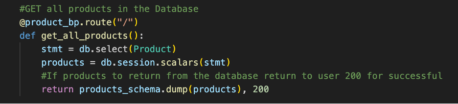
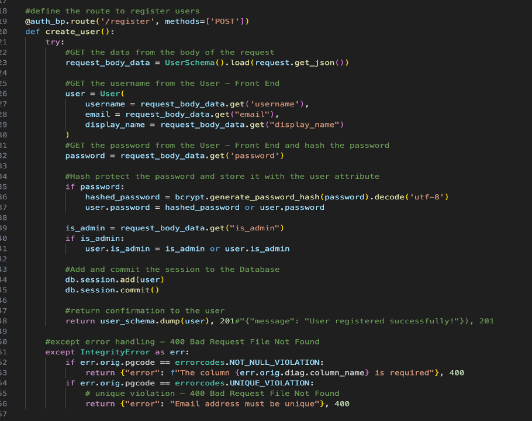
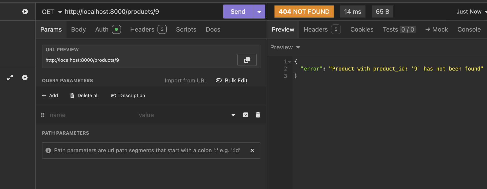

Table of Contents

[R1. Explain the problem that this app will solve and explain how this app solves or addresses the problem.](#r1)

[R2. Describe the way tasks are allocated and tracked in your project.](#r2)

[R3. List and explain the third-party services, packages and dependencies used in this app.](#r3)

[R4. Explain the benefits and drawbacks of this app’s underlying database system.](#r4)

[R5.  Explain the features, purpose and functionalities of the object-relational mapping system (ORM) used in this app.](#r5)

[R6. Design an entity relationship diagram (ERD) for this app’s database and explain how the relations between the diagramed models will aid the database design. 
This should focus on the database design BEFORE coding has begun, eg. during the project planning or design phase. ](#r6)

[R7. Explain the implemented models and their relationships, including how the relationships aid the database implementation. This should focus on the database implementation AFTER coding has begun, eg. during the project development phase.](#r7)

[User Model](#user)

[Product Model](#product)

[Review Model](#review)

[R8. Explain how to use this application’s API endpoints. Each endpoint should be explained, including the following data for each endpoint:](#r8)

[User Controller](#user_controller)

[Product Controller](#produduct_controller)

[Review Controller](#review_controller)

[References](#references)

## R1

Brands and consumers often face challenges when trying to make informed decisions when buying quality products, as not all products are created equally. With an overwhelming amount of products to choose from both online and instore, it can be difficult to discern which products are indeed high-quality and worth the price tag and the investment. Consumers frequently encounter some of the following concerns when purchasing products.

Overwhelming choices – The sheer volume of products available on the market can lead to decision stalemate.
Inconsistent review – Not all review are trustworthy, biased, fake or bought reviews can skew people perceptions, and people are unsure if the reviews are legitimate.
Lack of Personalisation – Reviews that don’t tailor to customers’ needs and individual preferences.
Difficulty Comparing Products – Consumers struggle to compare the features, prices and user experiences, as again consumers are unsure of trustworthy reviews.

This app solves the problem of legitimacy, as it is an independent app where people can post their honest reviews, good bad or indifferent, it can be customized into categories. This app will incorporate customer reviews and/or buying guidelines to enhance the credibility of the product being reviewed, whereby helping consumers make more informed decisions. It will foster a community of users who can ask questions, share their experiences, and provide real-time feedback, creating a more interactive environment.

![Stats-image](./docs/stats.png

According to surveys, about 84% of consumers trust online review as much as personal recommendations. This highlights the significance of reviews in consumers decision making. 90% of consumers write reviews to help others make good decisions. Research indicates that 70% of consumers advise they research a product before making a purchase and read on average 7 reviews before trusting a product.  Products with positive reviews can increase sales but up to 18% while a negative review can deter around 22% of potential consumers. While 12% in brand advocacy results in an increase of two times in revenue.
With the introduction of iPhones, mobile phone shopping is accounted for more than 50% of consumers purchases, with a strong lean to those looking at product reviews while in store before purchasing. 

This emphasises the need for accessible review platforms. These statistics illustrate the critical role product review apps play in shaping consumer behaviour and driving sales, thus highlighting their value in the ecommerce landscape

## R2

Task Creation and Allocation
Tasks are defined and loaded into Trello, where each task is allocated a status indicator, (Started, In Progress, Completed) that gets updated as each task is worked on to update the project management progress.
 

I utilise the dashboard for the task status to track progress, completions, deadlines. This visualisation of tasks helps me quickly assess where I am up to with the project and what needs to be addressed next. This structured approach helps maintain clarity and efficiency in managing all the tasks associated with project managing an API project and helps to effectively meet the goals with Trello’s tracking methods

Trello Board Set Up
A Trello board is created specifically for the project, organizing the different work stages and all task required to complete an API.

Trello link:
[https://trello.com/b/D5H9HIvn/product-review](https://trello.com/b/D5H9HIvn/product-review)

Tracking of Progress
As tasks are started the Trello board is updated with the progress of each task, with Started, In Progress, and Completion, each task us updated notes with regards to the progress of each stage.

Labels and Due Dates
Each task is labeled for cleared task management, and due dates are applied to make sure timelines are adhered to. Also checklists to help ascertain if items are ticked off.

Report
Trello has a built if feature to help report performance and identify areas of improvement.

GitHub

Github was used to track all changes to the webserver project which allowed recovery of data from previous commits if necessary. Each file was updated and committed with a git init, git status, git add ., git commit -m”meaningful message”, and git push origin main.

 
## R3

In our API we had leveraged several third party services, packages and libraries to enhance the functionality and app development, below is a breakdown of utilised packages. By utilising SQL’s base-classes for all models called db.Model

Flask

The Flask application library enhances database functionality and streamlines development, it is utilised for lightweight web applications where it serves as the backbone of managing routing, requests and responses

@app.route('/')
def home():
    return 'Hello, World!'`

Bcrypt

pip3 install flask_bcrypt

Bcrypt is utilised for secure password hashing to protect valuable information. It is a lightweight WSGI web application framework for Python. It serves as the foundation for building the web app by handling the routing, requests and responses and is an extension for Flask. Bcrypt enables secure password storage by hashing passwords with the bcrypt algorithm making them resistant to brute force cyber-attacks. It also allows the developer to assign user management by defining user models that include hashed passwords.
 

JWT Extended

pip3 install flask_jwt_extended

Is one of the ways you can implement security with a token-based authentication into your API Is standard for creating tokens that get used for authentication and authorisation of web applications for your APIs. JWT is a type of toke that has a structure that can be decrypted by a server and allows authenticating of the users’ identity of the application. Unlike other token types, JWT tokens largely contain necessary information without the use of an external database. It consists of three parts H P S the Header, the Payload, and the Signature.
Header – This stores the token encryption algorithm
Payload – This contains the data identifiers for the user like ID or username
Signature – This is the digital signature which is generated with the Header and Payload to verify the content.

SQLAlchemy

pip3 install flask_sqlalchemy

For Python SQLAlchemy is a flexible, powerful toolkit for ORM. It is designed for efficiency and high performance database access and is an extension that simplifies database interactions by providing an Object Relational Mapping (ORM) layer making it easier to define the models and query the database directly.
 
You use Column to define your database columns. The name that you assign to your column becomes the column name. It utilises the table relationships with ONE-TO-ONE, ONE-TO-MANY, and MANY-TO-MANY relationships.

Is not just an adapter but a more like a comprehensive toolkit for ORM systems and Python applications. Its complexities for database communications allows developers to engage and interact with the database using Python expressions. SQLAlchemy enables you to map python objects to database tables. It automatically translates Python expressions into SQL code reducing the need for writing SQL queries.

 

Psycopg2-binary

pip3 install psycopg2-binary

Is the most popular PostgreSQL adapter for Python its purpose is to allow the application to connect and interact with the database. Its binary version simplifies installation by including the necessary libraries and thread safety. It serves as a bridge to enable you to directly interact with your PostgreSQL database.

Marshmallow

pip3 install flask_marshmallow
pip3 install marshmallow_sqlalchemy

This application has been used to create schemas to help to seralise and deserialise objects in python into readable objects for the viewing panel. It is used inside the model for validating user input and nested attributes, also used fields, and validate 

Dot-env
Is a Python Flask extension that loads and environment variable from a .env file, it manages sensitive configurations securely, for example database URL’s and secret keys. It helps with modularization and separates the application logic from the configuration data.

pip3 install flask-dotenv

## R4

Flask is a standard Python web structure that is used to craft RESTful APIs for data engineering tasks. It provides a flexible and simple way to build your API’s that can handle HTTP requests and responses. Flask API projects commonly use PostgreSQL database systems. PostgreSQL is an open-source relational database management system which is known for its extensibility, reliability, data integrity, robustness, and extensive feature set. It can handle advanced data types, complex queries, foreign keys, triggers, and views as well as procedural languages for stored procedures. Its high expandability, allowing users to add new functions and data types.  Its strong SQL compliance and combined support for ACID (Atomicity, Consistency, Isolation, Durability) properties, make it an efficient, scalable and secure database choice for developers.

Below are some of the examples of using Flask.

1.	Data Retrieval: Flask can be used to construct APIs to retrieve data from databases, files or external API’s.  See example below; When you access the http address in your browser it will retrieve data from the PostgreSQL database and return it as a JSON response.

 

Data Transformation: Flask can be utilised to construct API’s to perform data calculations. Here is an example that calculates the sum of two numbers.
   

2.	Data Ingestion: Flask can be used to construct API’s that accept data uploads or input data from external sources. Example below of accepting a file upload and saves to the server.

These are just a few examples of the ways in which Flask can be used in data engineering tasks

Look at the Statistics
“StackOverflow statistics show that 26% of developers preferred it in 2017, 34% in 2019, and 40% in 2021. Most recently, in StackOverflow’s  2022 Stack Developer Survey, PostgreSQL took a slight lead over MySQL (46.48% to 45.68%) as the most popular database platform among professional developers.“ Author -Pete Scott – Percona Feb 2, 2024.

The Pros and Cons of using PostgreSQL in Flask;

Pros of Using PostgreSQL
Advanced Features
Acid Compliance – it ensures data integrity is maintained by supporting transactions and rollback capabilities.
Extensibility
It allows you to define custom data types, operators and index types. It also supports extensions like PostGIS for geographical/geospatial data, which is useful for location-based applications.
Scalability
PostgreSQL performs well on large scale datasets and is capable of handling high workloads by vertical scaling (adding more powerful hardware) With tools like Citus, PostgreSQL can also scale horizontally distribution data across many nodes.
SQL Compliance
PostgreSQL adheres closely with standards compliance making it easier for developers to work with who are familiar with SQL. It also supports advanced SQL window functions, these are valuable when using analytical queries.
Community and Available Documentation
PostgreSQL has a strong active community, who provide support and contribute to further developing.  It’s highly detailed documentation assists developers utilise its systems effectively.

Cons of Using PostgreSQL
Complexity
PostgreSQL can be complex to configure and tune for optimal performance, especially on large scale projects. New users may find it hard to learn, particularly those unfamiliar with the advanced database features and functions.
Performance Overhead
While PostgreSQL excels in read heavy scenarios, write heavy scenarios might encounter performance overhead due to its consistency and transactional features. Also, its indexing and query optimization, PostgreSQL complex queries and indexing can sometimes create performance issues when not properly optimized.
Resource Usage
Disk and memory usage can be resource intensive, it uses significant amounts of disk space and memory, which may be a concern for certain constrained environments.
Tooling and Ecosystem
Compared to other databases there may be limited tools and third-party options, integrations specifically designed for PostgreSQL are continuously improving.
Replication
Complex replication setups and high availability may be involved and require additional configurations or tools.

For many Flask applications, PostgreSQL is a robust choice, because of its strong feature set, community support and complex data requirements, its advanced features like full-text search and custom data types, couple that with high data integrity and consistency, it’s understandable why its popular. However, it is still essential to base your applications specifics on whether PostgreSQL is suitable for your project’s needs.

## R5

The primary purpose of the ORM system in the product review app is to streamline the database interactions, improve developer productivity and enhance maintainability and quicker feature development for easier updates. This is a brief list of features below.

-	ORM provides a high-level construct over the database interactions and allows developers to work with the objects rather that the raw SQL queries by simplifying the database operations. 
-	It forces you to write MVC code, which makes your code a little cleaner.
-	By mapping classes to database tables, this makes it easier to manage and manipulate the data. 
-	Sanitizing prepared statements or transactions are as easy as calling a method.
-	Each class represents a table, and each instance of the class represents the row of each table. 
-	ORM automatically generates SQL queries based on the object operations, this then reduces the need for manual SQL coding which minimises errors. 
-	It keeps track of changes made to objects, ensuring only modified data is sent to the database.
-	It handles relationships between the objects (1 to many, many to many) using associations, to simplify and manage the complex data relationships.
-	ORM has built in support for transactions management to ensure data consistency and integrity.

By incorporating an ORM system the product review app can efficiently manage the data, streamline development processes and ensure that the application is scalable and maintainable, some of ORM’s functionalities below.

-	CRUD operations like CREATE, READ, UPDATE, DELETE through object manipulation.
 

-	Data Validation which provides built in validation features to ensure data integrity.
-	Supports complex queries for filtering through object-oriented interfaces to allow developers to retrieve data efficiently.
-	Implements caching to reduce database load, it stores frequently accessed data efficiently for improved application performance.
-	Easy database schema migrations, make managing changes in the database structure easier over time.
-	Offers a multi database system support, allowing the app to switch databases with minimal code changes. 
 
 

 
## R6

 
An Entity Relationship diagram is a visual representation of the entities in a database system and their relationships to one another. For the product review app, the ER diagram typically includes entities such as Users, Products, Reviews and Categories. Below is the breakdown of each entity table.

Users
This entity represents the users of the app, storing their details, and passwords safely (hashed). Each user can submit multiple reviews.
-	UserID (Primary Key) and not null
-	Name
-	Display Name 
-	Email, not null
-	Password (hash)
-	Admin_user

Products
This entity represents the products being reviewed in the app. Each product can have multiple reviews from different users.
-	ProductID (Primary Key) and not null
-	Name
-	Description
-	Category
-	UserID (Foreign Key), not null

Reviews
This entity is the Junction table, it connects users and products together. Users can leave many reviews, and a products can have many reviews. It stores the rating and the comment for each product review.
-	RatingID
-	Rating – 1-5 rating
-	Comment
-	UserID (Foreign Key)
-	Product ID (Foreign Key)
-	Date – datetime delta

As you can see there are a few entities that have relationships to each other in the form of Foreign Key connections. These connects are important in the way you manage the data in the database.

Users table has a 1 mandatory relationship to many optional relationships with the Products table. Being that one user can list many products to review, and many products can be listed by one user.

Products table has a relationship with the User table, and the Review table. The relationship with the Users table has been discussed above.

Reviews table is where it all comes together as a Junction table, it is linked to the Users table via the Foreign Key and is linked with a one optional to many optional relationship. Reviews is also linked to Product table via its Foreign Key with its one mandatory product to many optional reviews relationship, it also pulls from the products relationship with categories to pull that data into its junction table. 

This ER diagram has a foundational structure which allows for efficient data management and retrieval.

## R7

The entity relationships help to shape and design the database. 

Data Integrity with the use of Foreign Keys (FK) ensures that each product review is associated with a valid user and valid product. This helps maintain referential integrity in the database helping to prevent orphaned records.  By implementing Foreign Keys, the database is ensured that every review has to correspond to a valid user and product. 

Query efficiency is maintained by the relationships, for example you can retrieve all reviews for a specific product or find all reviews written by a certain user. The relationship helps to support the apps functionality by making data retrieval streamlined. 

Scalability, with the one-to-many relationships enable the system to scale more easily. As more users and products get added to the database, the structure can accommodate the growth without requiring major redesigns. Each user can add multiple reviews, and it is designed so that each product can receive multiple reviews. 

Flexibility for filtering reviews by the user or product enables better searching and sorting functions in the app. Future features may include updated user preferences which could alter review suggestions. 

Normalisation helps minimise data redundancy and improves the datas’ integrity. User information is stored once, and reviews do not need to be duplicated. By separating User, Product, and Review models/entities, the implementation adheres to normalization principles, reducing the redundancy
During the project development phase, implementing User, Product and Review entities with their respective relationships establishes a robust database structure. This design aids in efficient data handling, and prepares for future enhancements, ensuring long term scalability and maintainability. The clearly defined interconnections in the entities, ensures development teams can focus on building features that will leverage the structured data efficiently.

### User Model 
 

#### User Controllers – Authentication_Controller
##### Create User

 

#### User Controllers – Authentication_Controller
##### Login_user

 
 

#### User Controllers – Authentication_Controller
##### Update_user

 

#### User Controllers – Authentication_Controller
##### Delete_user

 
 

 #### User Controllers – Authentication_Controller
##### Get_user

 

 

#### Product Model
#### User Controllers – Authentication_Controller
##### Delete_user

 

 
 

#### Product Controllers
##### Get all products, Get a Product(<product_id>)

  

#### Product Controllers
##### Add a Product, Delete a Product 

  

#### Product Controllers
##### Update Product

   

 

#### Review Model

   
 

#### Review_Controllers
##### Add Review
  
 

#### Review_Controller
##### Delete Review

 

 

#### Review_Controller
##### Get_a_Review, Update_Review

 
 
## R8

### User Controller
The product model is set up with specific attributes for the tables, and the controller actions these from the front end user input. Id is autogenerated, username can not be null, display_name can not be null, email can not be null, and password can not be null.

#### CREATE a User 

 

HTTP Verb – methods=[‘POST’]
Path or Route: http://localhost:8000/auth/register 

Required body/header –username, email, display_name, password 

 
Response – 
    Success:201 Created 

Error: “Email address is not unique” 400
 

#### Login a User
The product model is set up with specific attributes for the tables, and the controller actions these from the front end user input. To login in a user, the jwt_token needs to be sourced from the database which matches the username and password.
HTTP Verb – POST
Path/Route: http://localhost:8000/login 
Required body/header – email, password, jwt token is then retrieved.

Response –
    Success: 200 Ok 
   
 
    Error: “Invalid user, email or password is incorrect.” 401 Unauthorised.
   

Error:”Token has expired” 401 Unauthorised
 

#### UPDATE a User

The product model is set up with specific attributes for the tables, and the controller actions these from the front end user input. With user update function, the user needs to supply their email address, and their password, the jwt token will be retrieved from the database if the email and password matches. 

HTTP Verb – PUT
Path/Route: http://localhost:8000/auth/users
Required body/header – email, password, jwt token
Response – 
    Success: “Updated changes successfully” 200 OK 
 
    Error: “Missing Authorisation Header, 401 Unauthorised 

    Error: “Token has expired” 401 Unauthorised 

#### GET All Users

The user model is set up with specific attributes for the tables, and the controller actions these in the front end for the user. With the GET ALL user function the SQLAlchemy accesses the database and retrieves all users in the database.
HTTP Verb – GET 
Path/Route: http://localhost:8000/users
Required body/header – 
Response –
    Success: 200 Ok – returns all users in the database to the view 

    Error: “No users to view” 

#### GET a Specific User
The user model is set up with specific attributes for the tables, and the controller actions these in the front end for the user. With the GET One user function the SQLAlchemy accesses the database and retrieves the specific user_id that matches the input data and retrieves it from the database.  

HTTP Verb – GET
Path/Route: http://localhost:8000/auth/<int:user_id>
 
Response –
    Success: 200OK

    Error: “No users to view, 200 OK
 

#### DELETE a USER
The user model is set up with specific attributes for the tables, and the controller actions these from the front end user input. The DELETE functions allows only an authorised admin user to Delete users from the table.

HTTP Verb – DELETE
Path or Route: http://localhost:8000/auth/1
Required body/header – Authorisation: bearer token for user authentication
Response – 
    Success: “User with user_id <user_id> has been successfully delted.” 200 OK 

    Error: “Only admin can perform this delete functions.” 403 Forbidden

 
### Product Controller

#### CREATE a Product
The product model is set up with specific attributes for the tables, and the controller actions these from the front end user input. The CREATE a product functions allows the user to input data into specific fields to add a product to the database. A JWT-Token is required to add a product to the database
 
HTTP Verb – POST
Path/Route: http://localhost:8000/products
Required body/header – name, description, category, user_id, JWT_Token
Response –
    Success: 201 Created 

    Error: “Invalid”, 400

#### UPDATE a PRODUCT
The product model is set up with specific attributes for the tables, and the controller actions these from the front end user input. The UPDATE function allows the user to input data into specific fields to update a product in the database, a JWT_Token is also required to update a product.

HTTP Verb –PUT,PATCH
Path or Route: http://localhost:8000/products/<product_id>
Required body/header – Authorisation: bearer token for user authentication, product_id, then the fields that are to updated
Response – 
    Success: “200 OK” 

    Error: “Product with product_id: {product_id} could not be found”, (404 Not Found)

#### GET a PRODUCT
The product model is set up with specific attributes for the tables, and the controller actions these from the front end user input. The GET a Product function allows the user to input <product_id> retrieve a specific product in the database.
 
HTTP Verb – GET
Path or Route: http://localhost:8000/product/<product_id>
Required body/header – Authorisation: bearer token for user authentication
Response – 
    Success: “Review was successfully created” 

    Error: “No product with {product_id} has been found” 404

#### GET all Products
The product model is set up with specific attributes for the tables, and the controller actions these from the front end user input. The GET ALL Products function allows the user to retrieve all products in the database.

 
HTTP Verb – GET
Path/Route: http://localhost:8000/products
Required body/header – products
Response –
    Success: 

    Error: “Invalid, products not found”, 404

#### DELETE a PRODUCT
The product model is set up with specific attributes for the tables, and the controller actions these from the front end user input. The DELETE functions allows only an authorised admin user to Delete users from the table.

HTTP Verb – DELETE
Path or Route: http://localhost:8000/products
Required body/header – Authorisation: bearer token for user authentication/ <int:product_id>
Response – 
    Success:  “Product {product_id} has been deleted!” 

    Error: “Missing Authorisation Header” 401 Unathorised 

### Review Controller

#### ADD a Review
HTTP Verb – POST
The REVIEW model is set up with specific attributes for the tables, and the controller actions these from the front end user input. The ADD REVIEW function allows the user to add a review to a specific product in the database. The JWT_Token is required to add a review.
 
Path/Route: http://localhost:8000/products/<int:product_id>/reviews
Required body/header – JWT Token, Rating, comment
Response – 
    Success: 201 Created OK 

    Error: "Product with <int:product_id> has not been found." (404 Not Found) 

    Error: “You are not authorised to update this review”, (403 Forbidden)

#### UPDATE a Review
The REVIEW model is set up with specific attributes for the tables, and the controller actions these from the front end user input. The UPDATE REVIEW function allows the user to update an existing review to a specific product in the database. Must have both product id and review id, must have JWT_Token to update
 
HTTP Verb – PUT, PATCH
Path/Route: http://localhost:8000/products/<int:product_id>/reviews/<int:review_id>
Required body/header – product_id  and review_id to update, JWT_Token
Response - 
    Success: “200 OK 

    Error: “Review with {review_id} as not been found” 404 

#### GET a Review by PRODUCT ID
The REVIEW model is set up with specific attributes for the tables, and the controller actions these from the front end user input. The GET a REVIEW by Product function allows the user to fetch a review for a specific product in the database. Must have both product id and review id.
 
HTTP Verb –  GET
Path/Route: http://localhost:8000/products/<int:products_id>/reviews
Required body/header:, product_id,
Response – 
    Success: , (200 OK) 

    Error: “User not found”, (404 Not Found)

#### DELETE a Review
The REVIEW model is set up with specific attributes for the tables, and the controller actions these from the front end user input. The DELETE a REVIEW must have product_id and review_id for the function to allow the user to DELETE a review for a specific product in the database. Must have JWT_Token and auth_as_admin Admin user only can delete.  

HTTP Verb – DELETE
Path/Route: http://localhost:8000/products/<int:products_id> / <int:review_id>
Required body/header –product_id, review_id plust JWT_Token  & Admin Authorisation: Bearer token for user authentication.
Response - 
    Success: “Message: {review_comment}”, (200 OK) 

    Error: “Review with {review_id} has not be found”, (404 Not Found) 

These API endpoints provide a comprehensive way to interact with the product review’s backend. It creates, retrieves, updates, and deletes user review while ensuring the data integrity and user authentication is maintained throughout the use of the app, the use of appropriate headers and error handling makes this a robust and scalable product review system.

#### References
4Geeks. (n.d.). Understanding JWT and how to implement a simple JWT with Flask. [online] Available at: https://4geeks.com/lesson/what-is-JWT-and-how-to-implement-with-Flask.
flask-sqlalchemy.palletsprojects.com. (n.d.). Declaring Models — Flask-SQLAlchemy Documentation (2.x). [online] Available at: https://flask-sqlalchemy.palletsprojects.com/en/2.x/models/.
Gregorio, F.D. (n.d.). psycopg2-binary: psycopg2 - Python-PostgreSQL Database Adapter. [online] PyPI. Available at: https://pypi.org/project/psycopg2-binary/.
Paget, S. (2024). Local Consumer Review Survey | Online Reviews Statistics & Trends. [online] BrightLocal. Available at: https://www.brightlocal.com/research/local-consumer-review-survey/.
Podium.com.au. (2023). Why Online Reviews Matter to Your Business (5 Reasons) - Podium. [online] Available at: https://www.podium.com.au/guides/online-reviews-matter/.
Stackify. (2017). What are CRUD Operations? Examples, Tutorials & More. [online] Available at: https://stackify.com/what-are-crud-operations/.
ThinkDigits Inc (2024). Learn how Flask-SQLAlchemy integrates SQLAlchemy to simplify database management in Flask apps, including setup, context handling, and convenience. [online] Linkedin.com. Available at: https://www.linkedin.com/pulse/relationship-between-sqlalchemy-flask-sqlalchemy-thinkdigits-hr1dc?trk=organization_guest_main-feed-card_feed-article-content [Accessed 29 Sep. 2024].
Timescale Blog. (2023). When and How to Use Psycopg2. [online] Available at: https://www.timescale.com/blog/when-and-how-to-use-psycopg2/.

Wei, H. (2019). ORM For Python: SQLAlchemy 101 with Code Example. [online] medium.com. Available at: https://medium.com/@haataa/orm-for-python-sqlalchemy-101-with-code-example-60868e65b0c.
